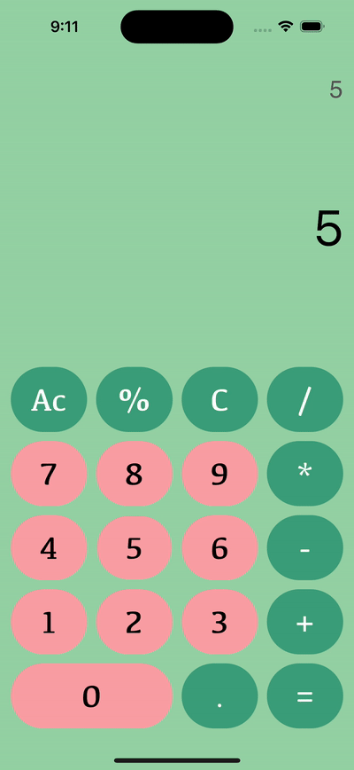

# 🧮 Calco

**CalCo** is a calculator app for beginners looking to master basic arithmetic operations. Designed with a clean and intuitive interface, SimpleCalc makes it easy to perform calculations on the go. Written entirely in Swift, this app is an excellent tool for both students and novice programmers who want to understand the fundamentals of iOS development.

## ✨ Features

- **➕ Basic Arithmetic Operations**: Add, subtract, multiply, and divide with ease.
- **💡 Responsive Design**: Enjoy a smooth and intuitive user experience with responsive animations and sound effects for button presses.
- **🎓 Educational Tool**: Ideal for beginners learning Swift and iOS development.
- **⚡ Lightweight**: Simple and fast, with a focus on essential functionality.

## 📱 App Previews

### 🏠 Home Screen


## ❓ Why CalCo App?

- **🛠️ Ease of Use**: No complex features, just a straightforward calculator that does the job.
- **📘 Educational**: Perfect for beginners to explore and learn Swift programming through a real-world application.
- **🌟 Clean Design**: A user-friendly interface that makes performing calculations a breeze.

## 🛠️ Installation

To install and run the SimpleCalc app, follow these steps:

1. Clone the repository:
    ```sh
    git clone https://github.com/yourusername/SimpleCalc.git
    ```

2. Open the project in Xcode:
    ```sh
    cd SimpleCalc
    open SimpleCalc.xcodeproj
    ```

3. Build and run the app on your preferred device or simulator.

## 🤝 Contributing

Contributions are welcome! If you find any bugs or have feature requests, please open an issue or submit a pull request.

## 📄 License

CalCo is released under the MIT License. See [LICENSE](LICENSE) for more details.

---

Download CalCo today and start calculating with confidence! 🚀
